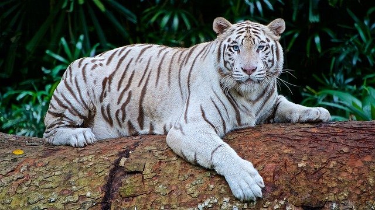

# Fehér tigris 

A fehér tigris egy ritka és lenyűgöző állatfaj, amely a bengáli tigris (**Panthera tigris tigris**) mutációja következtében jön létre. A fehér tigris nem külön faj, hanem egy genetikai variáns, amely a bengáli tigrisek között fordul elő. A fehér szín a tigriseknél egy recesszív génmutáció következménye, amely a narancssárga szőrzetet helyettesíti hófehér szőrzettel, miközben a fekete csíkok megmaradnak. Ez a mutáció csak akkor jelentkezik, ha mindkét szülő hordozza ezt a gént, így a fehér tigrisek rendkívül ritkák a természetben.

## Fizikai jellemzők

A fehér tigrisek testfelépítése és biológiai jellemzőik alapvetően megegyeznek a szokásos bengáli tigrisével. Általában nagyobbak, mint a többi tigris, és akár 3 méter hosszúra is megnőhetnek, súlyuk elérheti az 300 kilogrammot is. A fehér tigrisek szemei különösen figyelemfelkeltőek, mivel az erőteljes kék színük van, ami még különlegesebbé teszi őket. Az ősi és félelmetes megjelenésük révén a fehér tigrisek rendkívüli vonzerőt gyakorolnak az emberekre, így nemcsak a vadonban, hanem az állatkertekben is népszerűek.

### A fehér szőrzet hatása a túlélésre

Bár a fehér tigrisek rendkívüli szépségükkel elbűvölik az embereket, fontos megjegyezni, hogy a génmutációval járó színesedés nem mindig előnyös a tigrisek számára. A fehér szőrzet miatt ezek az állatok kevésbé álcázottak, és nehezebben olvadnak bele a természetes környezetükbe, ami megnehezíti számukra a vadászatot és a túlélést.